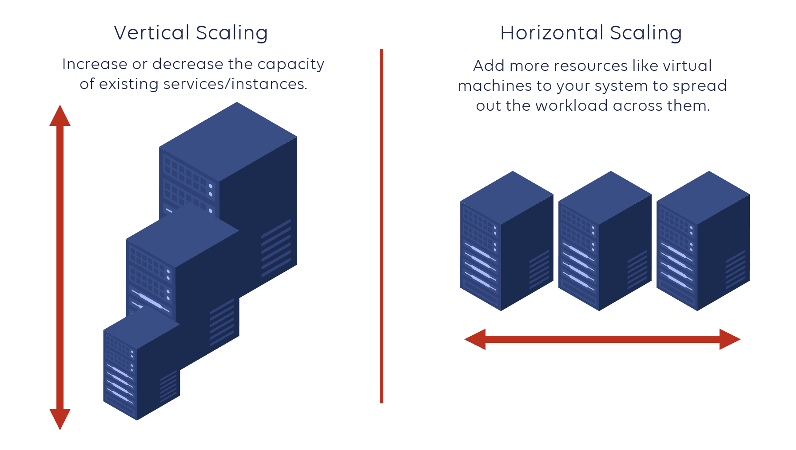

#Addressing Performance and Scaling Issues: Exploring Load Balancers and Scaling Solutions.
## Here's an overview of these concepts:
## Load Balancers:

- Load balancers distribute incoming network traffic across multiple servers to optimize resource utilization and improve application performance.
- They act as an intermediary between clients and backend servers, ensuring that each server receives an appropriate share of the workload.
- Load balancers can perform various load balancing algorithms, such as round-robin, least connections, IP hash, or weighted distribution.
- They help achieve high availability by detecting server failures and redirecting traffic to healthy servers.

## Vertical Scaling:

- Vertical scaling, also known as scaling up, involves increasing the capacity of a single server by adding more resources to it.
- Resources that can be scaled vertically include CPU, memory, storage, or network bandwidth.
- Vertical scaling usually involves upgrading hardware components or increasing the capacity of virtual machines.
- It is suitable when the application can run on a single server, but performance is limited by resource constraints.

## Horizontal Scaling:

- Horizontal scaling, also known as scaling out, involves adding more servers to the system to handle increased workload.
- Each server operates independently, and the workload is distributed among them.

- Horizontal scaling requires load balancing to evenly distribute incoming requests across the multiple servers.
- It is suitable when the workload exceeds the capacity of a single server or when high availability and scalability are required.

To address the performance and scaling issues in the project, a combination of load balancing and vertical/horizontal scaling approaches may be appropriate. Load balancers help distribute the workload efficiently among multiple servers, improving performance and availability. Vertical scaling allows increasing the capacity of individual servers, while horizontal scaling enables adding more servers to handle increased workload and provide fault tolerance.

