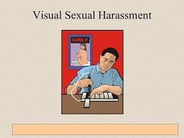

#Sexual harassment 

- Sexual harassment is a form of unwanted and unwelcome behavior of a sexual nature that occurs in various social settings, including workplaces, educational institutions, public spaces, or social interactions. It involves any form of sexual attention or advances that are imposed upon an individual without their consent, causing them discomfort, distress, or harm.

## Sexual harassment is categories in three types.

## 1. Verbal Sexual Harassment:  
This type involves unwelcome sexual comments, jokes, or conversations of a sexual nature. It may include sexually explicit remarks, sexual innuendos, sexual propositions, or unwanted compliments about a person's appearance or body. Verbal sexual harassment can occur in person, over the phone, or through digital communication.

## 2. Physical Sexual Harassment:
This type involves unwanted physical contact of a sexual nature. It may include touching, fondling, hugging, kissing, or any other physical advances that are sexual in nature and made without consent. Physical sexual harassment can happen in workplaces, public spaces, or social gatherings.

## 3.Visual Sexual Harassment: 
This type involves displaying sexually explicit materials, images, or videos without the individual's consent. It may include showing pornography, explicit photos, or inappropriate content that is offensive and creates a hostile environment for others.

# What would you do in case you face or witness any incident or repeated incidents of such behaviour?

##1. Speak Up or Report:
 If you feel comfortable and safe doing so, consider speaking up directly to the person involved and clearly stating that their behavior is inappropriate and unwelcome. Alternatively, report the incident to a person in authority, such as a supervisor, manager, teacher, or human resources representative, depending on the setting where the harassment occurred.
##2.Follow Organizational Policies:
 If you're dealing with sexual harassment in a workplace or educational setting, familiarize yourself with the organization's policies and procedures for reporting and addressing such incidents. Follow the established protocols to ensure the incident is properly handled.
##3.Encourage Others to Speak Up: 
If you witness sexual harassment, encourage the victim to report the incident and offer your support. Be a supportive ally and advocate for a safe environment for everyone.
